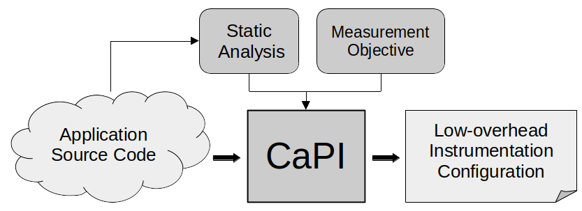

# CaPI: Compiler-assisted Performance Instrumentation 

CaPI is a selective code instrumentation tool, designed for streamlining the performance analysis workflow of large-scale parallel applications.

CaPI selects functions for instrumentation according to the needs of the analyst, based on a static call graph of the target application,.
This creates instrumentation configurations (ICs) that capture relevant parts of the code, while keeping the runtime overhead low.


It consists of two major components:
- A selection tool, that creates ICs tailored to the target code and measurement objective.
- A runtime library, enabling runtime-adaptable binary instrumentation based on [LLVM XRay](https://llvm.org/docs/XRay.html). 

CaPI currently supports the following measurement APIs:
- GNU interface: compatible with GCC's `-finstrument-functions`
- TALP (part of the DLB library): Parallel performance metrics of MPI regions
- Score-P: Instrumentation-based profiling and tracing
- Extrae: MPI-based tracing

This project is currently in a pre-release state, frequent changes to the code and build config can be expected.

## Requirements

- CMake >=3.15
- LLVM >=10 (>=20 for XRay shared library instrumentation)
- MetaCG
- ScoreP 7.x (optional)
- DLB 3.5 (optional, other versions _may_ work)
- Extrae 3.8.3 (optional, other versions _may_ work)
- LLVM-Lit (for testing only)

## Build
CaPI is built as follows ([Ninja](https://github.com/ninja-build/ninja) is not required and can be substituted with `make`).
```
mkdir build && cd build
cmake -G Ninja -DCMAKE_BUILD_TYPE=Release -DCMAKE_C_COMPILER=$(which clang) -DCMAKE_CXX_COMPILER=$(which clang++) -DDLB_DIR=$(which dlb)/../.. -DSCOREP_DIR=$(which scorep)/../.. .. 
ninja
```

CMake Options
- `ENABLE_TALP=ON/OFF`: Enable/Disable support for TALP. Default is `ON`.
  - `DLB_DIR`: Path to DLB installation.
- `ENABLE_SCOREP=ON/OFF`: Enable/Disable support for Score-P. Default is `ON`.
  - `SCOREP_DIR`: Path to Score-P installation.
- `ENABLE_EXTRAE=ON/OFF`: Enable/Disable support for Extrae. Default is `ON`.
- `ENABLE_XRAY=ON/OFF`: Enable/Disable support for runtime-adaptable instrumentation with LLVM XRay. Default is `ON`.
- `ENABLE_TESTING=ON/OFF`: Enable/Disable testing. Requires MetaCG and LLVM-Lit.
  - Set `metacg_DIR` to MetaCG installation directory.

<!-- The container does currently not work
## Container
The easiest way to try out CaPI is to install the [apptainer](https://apptainer.org/) provided in the `container` directory.
The container provides installations of CaPI and all dependencies. 
To build it in sandbox mode, run the following command: 
```
apptainer build --sandbox --fakeroot capi container/capi.def
```
Afterwards, you may open a shell into the sandbox as follow:
```
apptainer shell --writable --fakeroot --cleanenv capi
```
Refer to the apptainer documentation for further options.
-->

## Examples
To verify your build, you may test out the instrumentation of proxy applications LULESH and AMG in the `example` folder (located in your current build directory).
For details, refer to `CAPI_README` in the `lulesh` folder.

## Instrumentation Selection

CaPI relies on [MetaCG](https://github.com/tudasc/MetaCG) for its whole-program call graph analysis.

In order to apply CaPI, you first need to install MetaCG and run it on your target application.
See the MetaCG README for instructions.

You can then run CaPI to generate the instrumentation configuration (IC).

The IC is determined by passing the functions in the CG through a composable pipeline of individual selectors.
Each of these selectors produces an output set that is in turn consumed by other selectors.

### Options
This is an overview of the current command line interface.
- `-h`   Print a list of options.
- `-i <query>`   Parse the selection query from the given string.
- `-f <file>`      Use a selection query file.
- `-o <file>`      The output IC file.
- `-v <verbosity>`     Set verbosity level (0-3, default is 2). Passing `-v` without argument sets it to 3.
- `--write-dot <file>`  Write a dotfile of the selected call-graph subset.
- `--replace-inlined <binary>`  Replaces inlined functions with parents. Requires passing the executable.
- `--output-format <output_format>`  Set the file format. Options are `scorep`, `json` (default) and `simple`
- `--debug`  Enable debugging mode.
- `--print-scc-stats`  Prints information about the strongly connected components (SCCs) of this call graph.
- `--traverse-virtual-dtors` Enable traversal of virtual destructors (may lead to over-approximation of destructor inheritance).

### Selection Query DSL

CaPI defines a DSL for the user-defined instrumentation selection.
The selection query is passed in as string with the `-i` flag:

```
capi -i '<selection_query>' callgraph.ipcg
```
Alternatively, `-f <file>` instructs CaPI to load the query from the given file.

#### Basic Query Usage

The query consists of a pipeline of selector instances, which can be named or anonymous.
Selectors types are pre-defined but can be customized via parameters.
Valid parameter types are strings (enclosed in double quotes), booleans (true/false), integers and floating point numbers.

Selectors can be combined using the pipe operator `|>`.
Most of the available selectors types take at least one pipeline definition as input.
These can be either in-place definitions or references to other named pipeline definitions, prefixed with `%`.

For example, the following selector pipeline, named `mpi`, uses the `by_name` selector to find all functions starting with `MPI_`.
```
mpi = %% |> by_name("MPI_.*")
```
The pipeline `%` is pre-defined and refers to an instance of the `EverythingSelector`, which selects every function in the call graph.
If no input is explicitly given, `%%` is added implicitly. 

The previous example can, thus, be simplified as follows:
```
mpi = by_name("MPI_.*")
```

To extend this example, we can look at functions that are on a call path to MPI communication:

```
mpi          = by_name("MPI_.*")
mpi_callpath = %mpi |> on_call_path_to
```

Another way to reduce overhead is to exclude functions that are marked as `inline`.
To achieve this, we need the `inline_specified` selector and combine the results using the `subtract` selector.
Note that `subtract` takes two input pipelines, which are specified as a tuple enclosed in square brackets `[A, B]`.
Adding this to the previous query, we get the following query:

```
mpi          = by_name("MPI_.*")
mpi_callpath = %mpi |> on_call_path_to
final        = [%mpi_callpath, inline_specified] |> subtract
```

To simplify the use of set operations like `subtract`, they can also be expressed as binary operators: 

| Set Operation | Selector    | Equivalent Operator |
|---------------|-------------|---------------------|
| union         | `join`      | `\|`                |
| intersection  | `intersect` | `&`                 |
| difference     | `subtract`   | `-`               |


Using the operator notation the query can be rewritten as
```
mpi          = by_name("MPI_.*")
mpi_callpath = %mpi |> on_call_path_to
final        = %mpi_callpath - inline_specified
```
or in a single line:
```
final        = (by_name("MPI_.*") |> on_call_path_to) - inline_specified
```

### Directives

Directives start with `!` and are used to control the parsing and selection process.
CaPI currently supports two types of directives: `!import` and `!instrument`. 

The `import` directive is used for loading existing selection modules.
This allows to build and re-use selection pipelines that are useful across multiple applications.
For example, the `mpi_callpath` selector from the previous example could be moved to a separate file `mpi.capi`:
```
!import("mpi.capi")
final = %mpi_callpath - inline_specified
```

The `instrument` directives gives explicit control over the created instrumentation configuration.
It allows the user to specify custom instrumentation levels and associated invocation ranges that are reflected in the
created instrumentation configuration file. 
```
# Instrument result of "A" with level "basic" 
!instrument(%A, "basic")

# Instrument result of "B" to record invocations 1-10 and 100 in "detail" level, invocations 11-99 in "basic" level.
!instrument(%B, "detail:1-10,100", "basic:11-99")
```
Note that only the custom `json` output format supports these features.
For other formats, only information about the set of instrumented functions is recorded.
If no `instrument` directive is specified, the result of the last pipeline definition is used. 


### List of available selectors

| Name                                                               | Parameters                  | Selector inputs | Example                                                 | Explanation                                                                                                    |
|--------------------------------------------------------------------|-----------------------------|-----------------|---------------------------------------------------------|----------------------------------------------------------------------------------------------------------------|
| by_name                                                            | regex string                | 1               | `by_name("foo.*")`                                      | Selects functions with names starting with "foo".                                                              |
| by_path                                                            | regex string                | 1               | `byPath("foo/.*")`                                      | Selects functions contained in directory "foo".                                                                |
| inline_specified                                                   | -                           | 1               | `inline_specified`                                      | Selects functions marked as `inline`.                                                                          |
| on_call_path_to                                                    | -                           | 1               | `by_name("foo") \|> on_call_path_to`                    | Selects functions in the call chain to function "foo".                                                         |
| on_call_path_from                                                  | -                           | 1               | `by_name("foo") \|> on_call_path_from`                  | Selects functions in the call chain from function "foo".                                                       |
| in_system_header                                                   | -                           | 1               | `in_system_header`                                      | Selects functions defined in system headers.                                                                   |
| contains_unresolved_calls                                          | -                           | 1               | `contains_unresolved_calls`                             | Selects functions containing calls to unknown target functions.                                                |
| join                                                               | -                           | 2               | `[%A, %B] \|> join` or `%A \| %B`                       | Union of the two input sets.                                                                                   |
| intersect                                                          | -                           | 2               | `[%A, %B] \|> intersect` or `%A & %B`                   | Intersection of the two input sets.                                                                            |
| subtract                                                           | -                           | 2               | `[%A, %B] \|> subtract` or `%A - %B`                    | Difference of the two input sets.                                                                              |
| coarse                                                             | -                           | 1 or 2          | `[%A, %B] \|> coarse`                                   | Filter out functions that have a single caller and callee, unless they are included in B.                      |
| min_call_depth                                                     | comp. operator, threshold   | 1               | `%A \|> min_call_depth("<=", 3)`                        | Selects functions that are at most 3 calls away from a root node.                                              |
| flops/memops                                                       | comp. operator, threshold   | 1               | `%A \|> flops(">=", 10)`                                | Selects functions with at least 10 floating point operations.                                                  |
| loop_depth                                                         | comp. operator, threshold   | 1               | `%A \|> loop_depth("=", 2)`                             | Selects functions containing loop nests of depth 2.                                                            |
| inclusive_statement_count                                          | comp. operator, threshold   | 1               | `%A \|> inclusive_statement_count(">", 100)`            | Selects functions with an inclusive statement count (statements in reachable sub-graph) > 100.                 |
| common_caller<br/>common_caller_distinct<br/>common_caller_partial | heuristic parameter         | 2               | `[by_name("foo"), by_name("bar")] \|> common_caller(1)` | Common caller selection with max. LCA-Dist 1 (details [here](#common-caller-selection-for-trace-augmentation)) |

#### Common caller selection for trace augmentation
The `common_caller` selectors are specialized heuristics for augmenting MPI based traces [[3]](https://doi.org/10.1007/978-3-031-73716-9_3).
To instrument a region in the trace, the surrounding MPI calls X and Y are determined.
Passing the name of the direct callers of X and Y to the `common_caller` query, CaPI selects relevant calls path leading to these calls.
Details will be made available in an upcoming publication.

#### TALP selectors
If CaPI is built with TALP support, the following selectors, based on TALP efficiency metrics attached to the call graph as function metadata, are available.

| Name                            | Parameters | Selector inputs | Example                                       | Explanation                                                             |
|----------------------------------|-------------|-----------------|-----------------------------------------------|-------------------------------------------------------------------------|
| has_talp_metrics                 | -           | 1               | `has_talp_metrics`                            | Selects the subset of functions that has TALP metrics attached.         |
| talp_cycles                      | 1           | 1               | `talp_cycles(">", 1000)`                      | Selection based on number of elapsed cycles.                            |
| talp_instructions                | 1           | 1               | `talp_instructions(">", 500000)`              | Selection based on number of executed instructions.                     |
| talp_measurements                | 1           | 1               | `talp_measurements(">", 5)`                   | Selection based on number of times a node was measured.                 |
| talp_mpi_calls                   | 1           | 1               | `talp_mpi_calls(">=", 10)`                    | Selection based on number of MPI calls.                                 |
| talp_omp_parallels               | 1           | 1               | `talp_omp_parallels(">=", 10)`                | Selection based on number of encountered OpenMP parallel regions        |
| talp_omp_tasks                   | 1           | 1               | `talp_omp_tasks(">=", 10)`                    | Selection based on number of encountered OpenMP tasks                   |
| talp_gpu_runtime_calls           | 1           | 1               | `talp_gpu_runtime_calls("<",60)`              | Selection based on number of CUDA/HIP runtime calls                     |
| talp_elapsed_time                | 1           | 1               | `talp_elapsed_time("<", 2.0e6)`               | Selection based on total elapsed time in nanoseconds.                   |
| talp_useful_time                 | 1           | 1               | `talp_useful_time("<", 2.0e6)`                | Selection based on total useful time in nanoseconds.                    |
| talp_parallel_efficiency         | 1           | 1               | `talp_parallel_efficiency("<", 0.8)`          | Selection based on overall parallel efficiency (ratio between 0 and 1). |
| talp_mpi_parallel_efficiency     | 1           | 1               | `talp_mpi_parallel_efficiency("<", 0.9)`      | Selection based on MPI parallel efficiency (ratio between 0 and 1).     |
| talp_mpi_comm_efficiency         | 1           | 1               | `talp_mpi_comm_efficiency("<", 0.85)`         | Selection based on MPI communication efficiency.                        |
| talp_mpi_load_balance            | 1           | 1               | `talp_mpi_load_balance("<", 0.95)`            | Selection based on MPI load balance efficiency.                         |
| talp_mpi_load_balance_in         | 1           | 1               | `talp_mpi_load_balance_in("<", 0.9)`          | Selection based on MPI intra-node load balance.                         |
| talp_mpi_load_balance_out        | 1           | 1               | `talp_mpi_load_balance_out("<", 0.9)`         | Selection based on MPI inter-node load balance.                         |
| talp_omp_parallel_efficiency     | 1           | 1               | `talp_omp_parallel_efficiency("<", 0.5)`      | Selection based on OpenMP parallel efficiency (ratio between 0 and 1)   |
| talp_omp_load_balance            | 1           | 1               | `talp_omp_load_balance("<", 0.5)`             | Selection based on OpenMP load balance                                  |
| talp_omp_scheduling_efficiency   | 1           | 1               | `talp_omp_scheduling_efficiency("<", 0.5)`    | Selection based on OpenMP scheduling efficiency                         |
| talp_omp_serialization_efficiency| 1           | 1               | `talp_omp_serialization_efficiency("<", 0.5)` | Selection based on OpenMP serialization efficiency                      |
| talp_device_offload_efficiency   | 1           | 1               | `talp_device_offload_efficiency("<", 0.5)`    | Selection based on GPU offload efficiency                               |
| talp_gpu_parallel_efficiency     | 1           | 1               | `talp_gpu_parallel_efficiency("<", 0.5)`      | Selection based on GPU parallel efficiency (ratio between 0 and 1).     |
| talp_gpu_comm_efficiency         | 1           | 1               | `talp_gpu_comm_efficiency("<", 0.5)`          | Selection based on GPU communication efficiency                         |
| talp_gpu_orch_efficiency         | 1           | 1               | `talp_gpu_orch_efficiency("<", 0.5)`          | Selection based on GPU orchestration efficiency                         |
| talp_dyn_filtered                | -           | 1               | `talp_dyn_filtered`                           | Selects functions filtered dynamically during TALP run.                 |
| talp_avg_region_duration         | 1           | 1               | `talp_avg_region_duration("<", 1e6)`          | Selection based on average elapsed nanoseconds per region invocation    |
| talp_avg_ipc                     | 1           | 1               | `talp_avg_ipc("<", 0.5)`                      | Selection based on average useful instructions per cycle value          |
| talp_avg_freq                    | 1           | 1               | `talp_avg_freq("<", 1e9)`                     | Selection based on average useful frequency in Herz                     |


### Inline compensation
LLVM-XRay currently does not support the instrumentation of inlined functions.
Since the MetaCG call graph is based on the source code, the information whether a function is inlined by the compiler is not directly available to CaPI.
As a result, the IC may contain inlined functions that cannot be instrumented.
The `--replace-inlined <executable_binary>` option was added to compensate this issue.
It detects which functions in the IC are not available in the binary and replaces them with direct callers.

## Instrumentation
The IC generated by CaPI is used to direct the instrumentation of the target application.
Static and dynamic instrumentation methods are supported.
However, due to their flexibility the dynamic instrumentation workflow using LLVM-XRay is prefered, since it allows for rapid iterative adjustments of the selection, 
without requiring the program to be rebuilt.

### Static Instrumentation with CaPI plugin for LLVM (deprecated)
You can use the provided compiler wrappers `clang-inst`/`clang-inst++` to build and instrument program.
Before building, set the environment variable `CAPI_FILTER_FILE` to the name of the generated IC file.
Please note that the compiler wrapper will not automatically link any measurement library.
You will need to pass the corresponding build flags yourself.

### Static Instrumentation with Score-P
Passing `--output-format scorep` to CaPI generates a filter file compatible with Score-P.
This enables directly instrumenting with the Score-P instrumenter.
To do this, simply build with `scorep-g++` and set `SCOREP_WRAPPER_INSTRUMENTER_FLAGS="--instrument-filter=<filter-file>"`.
To enable measuring functions in shared libraries, use the [Score-P Symbol Injector](https://github.com/sebastiankreutzer/scorep-symbol-injector) library (Note: as of Score-P 8, this is no longer necessary).

### Dynamic Instrumentation with LLVM XRay
CaPI now provides a runtime library compatible with [LLVM XRay](https://llvm.org/docs/XRay.html).
Instead of using a statically instrumented build for each IC, this enables dynamic instrumentation during program initialization.
With XRay, only one build is required and ICs can be changed without recompilation.
**Note**: This requires LLVM version 20 or newer.

You can toggle this feature by setting `ENABLE_XRAY=ON` on.
This will generate the compiler wrapper `capicc` in the `scripts` subdirectory of your current build.
This wrapper automatically adds the required flags to instrument your code and link in the necessary dependencies.
A corresponding wrapper is generated in the install tree as well.
To use it, simply prepend your existing compiler invocation with this wrapper.
For example, Makefile-based projects can be compiled with `make CC='capicc clang' CXX='capicc clang++'`.

There are currently five different tool interfaces implemented in the following CaPI runtime libraries:
- `libcapixray_gnu.a`: Compatible with `-finstrument-functions`. Calls `__cyg_profile_func_enter` on enter and `__cyg_profile_func_exit` on exit.
- `libcapixray_scorep.a`: Compatible with the GNU interface of Score-P.
- `libcapixray_talp.a`: Interface for the TALP tool.
- `libcapixray_extrae.a`: Interface for the Extrae tool.
- `libcapixray_nesmik.a`: Interface for NeSmiK.

The tool interface is selected in the wrapper by passing `--capi-interface=<gnu/scorep/talp/extrae/nesmik>`.

To instrument the program at startup, set the environment variable `CAPI_FILTERING_FILE=<ic_file>`.

As an alternative to the wrappers, it is also possible to pass the required flags manually.
When building the target application, you will need to use the Clang compiler and pass the flag `-fxray-instrument`.
XRay uses a pre-filtering mechanism to exclude very small functions. If you want to be able to potentially instrument all functions, you need to pass `-fxray-instruction-threshold=1` as well.
You will then need to link the XRay-compatible CaPI runtime library into your executable by adding the following:
`-Wl,--whole-archive <capi_build_dir>/lib/xray/libcapixray_<capi_interface>.a -Wl,--no-whole-archive`, along with the required LLVM dependencies given by `llvm-config --libfiles xray symbolize --link-static --system-libs`.

<!---
## Ongoing development
We are currently evaluating a new call-graph analysis method that runs at link-time.
A LLVM linker plugin embeds the call-graph into the binary.
This allows the CaPI runtime to load the call-graph dynamically and to merge call-graphs of shared libraries on the fly.
This work is currently in development and will be made public in the near future.
-->

## Publications
[1] Kreutzer, S., Iwainsky, C., Lehr, JP., Bischof, C. (2022). Compiler-Assisted Instrumentation Selection for Large-Scale C++ Codes. In: Anzt, H., Bienz, A., Luszczek, P., Baboulin, M. (eds) High Performance Computing. ISC High Performance 2022 International Workshops. ISC High Performance 2022. Lecture Notes in Computer Science, vol 13387. Springer, Cham. https://doi.org/10.1007/978-3-031-23220-6_1

[2] S. Kreutzer, C. Iwainsky, M. Garcia-Gasulla, V. Lopez and C. Bischof, "Runtime-Adaptable Selective Performance Instrumentation," 2023 IEEE International Parallel and Distributed Processing Symposium Workshops (IPDPSW), St. Petersburg, FL, USA, 2023, pp. 423-432, doi: 10.1109/IPDPSW59300.2023.00073.

[3] Kreutzer, S., Serra, J.P., Iwainsky, C., Gasulla, M.G., Bischof, C. (2025). Augmentation of MPI Traces Using Selective Instrumentation. In: Weiland, M., Neuwirth, S., Kruse, C., Weinzierl, T. (eds) High Performance Computing. ISC High Performance 2024 International Workshops. ISC High Performance 2023. Lecture Notes in Computer Science, vol 15058. Springer, Cham. https://doi.org/10.1007/978-3-031-73716-9_3
